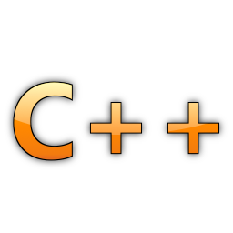

title: Convertir String a int C++
tags: C++,c

Bueno acá va nuestro primer post.

Cuando somos principiantes tenemos problemas con los tipos de datos; los string, char, punteros (uff que problemas), int, etc.

Clásico de clásicos es convertir tipo de dato string a int, esto se puede solucionar fácil después que tenemos un poco más de experiencia, destaco que tampoco no soy un gran programador de c++ pero fue uno de los primeros lenguajes que conocí.

Vamos a aprovechar que en c hay una función llamada atoi que convierte ASCII a int que está en la librería _stdlib.h_. Recordemos que c en un sub-conjunto del lenguaje c++, y que todas las funciones de c son funcionales en c++. Quizás es por eso que c++ es lenguaje complicado a mi parecer donde abarca mucho (c y c++).

Entonces atoi recibe un parámetro, un puntero de char(el string en nuestro caso) y nos retorna el valor int :).

Y acá el código:

~~~{cpp}
#include <iostream>
#include <string>
#include <stdlib.h>

using namespace std;

int main()
{
    string p = "345";
    char k[] = "345";
    int primer = atoi(p.c_str());
    int segundo = atoi(k);
    if( primer == segundo )
    {
        cout << "Son iguales" << endl;
    }

}
~~~

Quizás les parezca extraño el:

~~~{cpp}
p.c_str()
~~~

Sólo nos transforma el string a char :P.

Lo demás se explica por sí mismo.

Esto sería, espero que les haya gustado y servido :).
