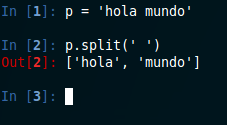

title: Jugando con string en c++
tags: string, c++

En un ramo de la universidad tuvimos que usar c++ con string. Se volvio complicado cuando necesitaba separar el string por
espacio o por otro caracter. En python esta función se llama split, que es muy fácil de usar y además viene implementada.
Lastima que en c++ no exita, pero no me quede ahí, las implemente y les muestro los resultados.

El aburrimiento resulto que implementará otras dos funciones muy utilizadas, en conclusión creé:

* Replace: Sirve para reemplzar un caracarter por otro en un string.
* Split: Retorna el string en un vector, separado por un char(delimitador).
* DeleteChar: Eliminar un carácter de un string.

En fin acá el código con las funciones y un main simple para que vean como funcionan:

~~~{cpp}
//============================================================================
// Name : main.cpp
// Author : Srochar
// Description : Implementando split,replace y eliminar caracter en string
//============================================================================

#include <iostream>
#include <string>
#include <vector>
#include <sstream>

using namespace std;

/*
* split, es un funcion que separa un string, por un determinado. Se retorna un vector.
* Buscamos la posicion del delimitador, separando el string principal en dos daba la posicion del
* delimitador. El primer trozo lo agregamos al vector y redifinimos el string principal por la otra mitad
* así hasta que no encontremos delimitador
* */
vector<string> split(string data,char delimi)
{
        vector<string> result;
        string sub;
        size_t pos, noEncontrado = -1;
        do {
                pos = data.find(delimi);
                sub = data.substr(0,pos);
                result.push_back(sub);
                data = data.substr(pos+1,data.length());
        } while (pos != noEncontrado);
        return result;
}

/*
* deleteChar una funcion simple que eliminar un char de un string.
* Buscamos la posicion del char que deseamos eliminar. Generamos dos partes según la posición.
* Y simplemente el resultado es la union del primer string y con la segunda pero una posición más.
* */
string deleteChar(string data,char noChar)
{
        //stringstream nos facilita la creacion de un string; con la entrada de varios otros string por el operador <<
        stringstream result;
        string sub;
        size_t pos, noEncontrado = -1;
        do {
                pos = data.find(noChar);
                sub = data.substr(0,pos);
                result << sub;
                data = data.substr(pos+1,data.length());
        } while (pos != noEncontrado);
        return result.str();
}

/*
* replaceChar reeplaza un char de un string
* Funciona igual que deleteChar solo que agregamos un new_char y volvemos a agregar el segundo string.
* */
string replaceChar(string data, char old_char, char new_char)
{
        stringstream result;
        string sub;
        size_t pos, noEncontrado = -1;
        do {
                pos = data.find(old_char);
                sub = data.substr(0,pos);
                result << sub << new_char;
                data = data.substr(pos+1,data.length());
        } while (pos != noEncontrado);
        sub = result.str();
        //debemos eliminar el último caracter, porque se agrega un new_char de más.
        sub = sub.substr(0,sub.length()-1);
        return sub;
}

int main()
{
        string p = "Esto es un string separado por espacios";
        string sin_espacio = deleteChar(p,' ');
        string sin_o = deleteChar(p,'o');
        vector<string> sinEspacio = split(p,' ');
        vector<string> sinO = split(p,'o');
        vector<string>::size_type it;
        string replace_spaceporguion = replaceChar(p,' ','-');
        string replace_oporguion = replaceChar(p,'o','-');
        cout << "String de ejemplo: "<<"'" << p << "'" << endl;
        cout << "Eliminando ' ' : " << sin_espacio << endl;
        cout << "Eliminando 'o' :" << sin_o << endl;
        cout << "Split por ' ': ";
        for (it = 0; it != sinEspacio.size(); ++it)
                cout << "[" << sinEspacio[it] << "],";
        cout << endl;
        cout << "Split por 'o': ";
        for (it = 0; it != sinO.size(); ++it)
                cout << "[" << sinO[it] << "],";
        cout << endl;
        cout << "Reemplazando Caracter ' ' por '-': " << replace_spaceporguion << endl;
        cout << "Reemplazando Caracter 'o' por '-': " << replace_oporguion << endl;
}
~~~

Resultado:

Dejo el github también para que puedan [descargar el código](https://github.com/srochar/split-replace-c).
Saludos!
