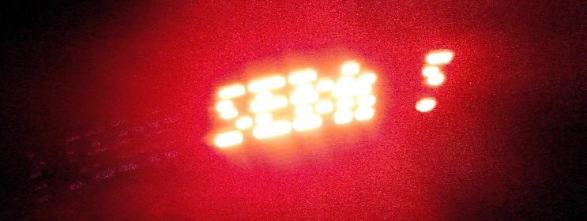
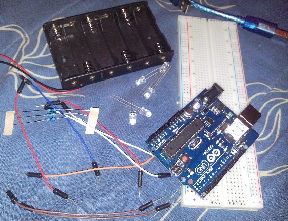
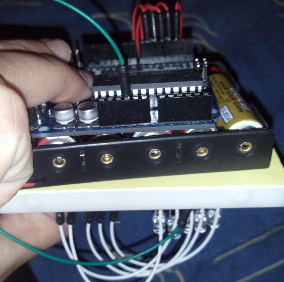

title: Como hacer una miniPov en arduino
category: misc
tags: 

Una minipov es un pequeño dispositivo que tiene conectada unos led que van palpadeando y que nosotros
al moverla genera mensaje, les muestro:

La verdad es algo súper artesanal ya que existe un chip que lo hace mucho más fácil. Pero como yo no tenía ese chip
lo hice con arduino, led y un cargador. Debo confesar que es bastante pesado pero se puede llegar a mover sin problemas.

Vamos con los requerimientos para crearlo, necesitamos:

* Cables
* 5 Resistencias de 220 ohm
* 5 Led, _ojalá todos del mismo color_
* Arduino
* Un conector de corriente
* Protobard

Les explicaré un poco como funciona, cada letra consta de una matriz 5x3, donde las columnas se irán cambiando
por un delay(pequeño cambio de tiempo) a la siguiente columna. En las filas simplemente daremos la orden de encender los led. Por ejemplo para la letra H su matriz sería:

|   |   |    |
|---|---|--- |
| x |   | x  |
| x |   | x  |
| x | x | x  |
| x |   | x  |
| x |   | x  |

Es por eso que necesitamos los 5 led para ir encendiendo por fila. Lo anterior lo representamos así en código:

~~~{cpp}
int H[] = {1,1,1,1,1, 0,0,1,0,0, 1,1,1,1,1};
~~~

De la matriz anterior pasamos a un arreglo simple, que iremos dividiendo en 5 partes y 3 veces. Al mismo tiempo
que vamos iterando por el arrelgo vamos a ir cambiando de led.

Les pego un ayudita y les entrego todas las letras en matriz a y se me olvidaba el espacio es simplemente
ningun led encendido.

¿ Tenemos las matriz pero como la dibujamos ?. Realizaremos un procedimiento que escriba la matriz, solo tenemos que
recorrer la matriz y donde encontremos un 1, encendemos el led que corresponda, luego aplicamos un delay(pequeña 
transicion de tiempo) y aplicamos lo anterior a la siguiente columna, así hasta terminar.

~~~{cpp}
void print_letra(int letra[])
{
	int y; // con esta variable vamos a ir iterando

	for(y = 0; y < 5 ; y++)
	{
		//y+2 representa al pin que estamos ubicados, recuerden que vamos a utilizar del 2 al 6
		//letra[y] va a ser el valor si enciendo o no tal led
		digitalWrite(y+2,letra[y]);
	}
	//aplicamos un delay entre filas
	delay(entre_puntos);
	//lo anterior lo repetimos 2 veces más teniendo la precaucion de ir moviendo el y para el arreglo
	for(y = 0; y < 5 ; y++)
	{
		//letra[y+5] por que debemos avanzar a las siguiente "fila"
		digitalWrite(y+2,letra[y+5]);
	}
	delay(entre_puntos);
	//lo hacemos la ultima vez
	for(y = 0; y < 5 ; y++)
	{
		digitalWrite(y+2,letra[y+10]);
	}
	delay(entre_puntos);
	//volvemos a poner todos los led en 0
	for(y = 0; y < 5 ; y++)
	{
		digitalWrite(y+2,0);
	}
	delay(entre_letras);
}
~~~

Ojo con los _delay()_ son valores que daremos globales y en _setup_ le asignaremos valores.

Y voilá, toda la parte de programación ya la tendriamos lista, falta armar nuestro circuito, lo que se daran cuenta
es bastante simple, es conectar 5 led, utilizaremos los pines del 2 al 6(digitales obvio), no olviden aplicar una
resistencia para no saturar los led!. Una foto como los conecte yo, bastante artesanal pero mejor para moverlo
cuando conectemos el cargador externo(a pilas).

 

Dibujemos el _Hola_. En el _loop_ sólo debemos llamar al procedimiento que creamos arriba y
dando las letras que necesitamos dibujar. En el _setup_ cargamos los pines que utilizaremos.

~~~{cpp}
/*
http://alumnos.informatica.utem.cl/~srocha/

Mini rutina de un programa que hace un miniPov en arduino.
Se necesita tener 5 led conectados del pin 2 al 6.
*/
int entre_puntos;
int entre_letras;

int _[] = {0,0,0,0,0, 0,0,0,0,0, 0,0,0,0,0};
int A[] = {0,1,1,1,1, 1,0,1,0,0, 0,1,1,1,1};
int B[] = {1,1,1,1,1, 1,0,1,0,1, 0,1,0,1,0};
int C[] = {0,1,1,1,0, 1,0,0,0,1, 1,0,0,0,1};
int D[] = {1,1,1,1,1, 1,0,0,0,1, 0,1,1,1,0};
int E[] = {1,1,1,1,1, 1,0,1,0,1, 1,0,1,0,1};
int F[] = {1,1,1,1,1, 1,0,1,0,0, 1,0,1,0,0};
int G[] = {0,1,1,1,0, 1,0,1,0,1, 0,0,1,1,0};
int H[] = {1,1,1,1,1, 0,0,1,0,0, 1,1,1,1,1};
int I[] = {0,0,0,0,1, 1,0,1,1,1, 0,0,0,0,1};
int J[] = {1,0,0,0,0, 1,0,0,0,1, 1,1,1,1,1};
int K[] = {1,1,1,1,1, 0,0,1,0,0, 0,1,0,1,1};
int L[] = {1,1,1,1,1, 0,0,0,0,1, 0,0,0,0,1};
int M[] = {1,1,1,1,1, 0,1,1,0,0, 0,1,1,1,1};
int N[] = {1,1,1,1,1, 1,0,0,0,0, 0,1,1,1,1};
int O[] = {0,1,1,1,0, 1,0,0,0,1, 0,1,1,1,0};
int P[] = {1,1,1,1,1, 1,0,1,0,0, 0,1,0,0,0};
int Q[] = {0,1,1,1,1, 1,0,0,1,1, 0,1,1,1,1};
int R[] = {1,1,1,1,1, 1,0,1,0,0, 0,1,0,1,1};
int S[] = {0,1,0,0,1, 1,0,1,0,1, 1,0,0,1,0};
int T[] = {1,0,0,0,0, 1,1,1,1,1, 1,0,0,0,0};
int U[] = {1,1,1,1,1, 0,0,0,0,1, 1,1,1,1,1};
int V[] = {1,1,1,1,0, 0,0,0,0,1, 1,1,1,1,0};
int W[] = {1,1,1,1,0, 0,0,1,1,0, 1,1,1,1,0};
int X[] = {1,1,0,1,1, 0,0,1,0,0, 1,1,0,1,1};
int Y[] = {1,1,0,0,0, 0,0,1,0,0, 1,1,1,1,1};
int Z[] = {1,0,0,1,1, 1,0,1,0,1, 1,1,0,0,1};

void print_letra(int letra[])
{
	int y; // con esta variable vamos a ir iterando

	for(y = 0; y < 5 ; y++)
	{
		//y+2 representa al pin que estamos ubicados, recuerden que vamos a utilizar del 2 al 6
		//letra[y] va a ser el valor si enciendo o no tal led
		digitalWrite(y+2,letra[y]);
	}
	//aplicamos un delay entre filas
	delay(entre_puntos);
	//lo anterior lo repetimos 2 veces más teniendo la precaucion de ir moviendo el y para el arreglo
	for(y = 0; y < 5 ; y++)
	{
		//letra[y+5] por que debemos avanzar a las siguiente "fila"
		digitalWrite(y+2,letra[y+5]);
	}
	delay(entre_puntos);
	//lo hacemos la ultima vez
	for(y = 0; y < 5 ; y++)
	{
		digitalWrite(y+2,letra[y+10]);
	}
	delay(entre_puntos);
	//volvemos a poner todos los led en 0
	for(y = 0; y < 5 ; y++)
	{
		digitalWrite(y+2,0);
	}
	delay(entre_letras);
}

void setup()
{
	int i;
	// iniciamos todos los led con un simple for :)
	for(i = 2 ; i <= 6 ; i++)
	{
		pinMode(i,OUTPUT);
	}
	entre_puntos = 3;
	entre_letras = 6;
}

void loop()
{
	print_letra(H);
	print_letra(O);
	print_letra(L);
	print_letra(A);
	print_letra(_);
}

~~~

Desconectamos y le damos corriente ahora por el cargador externo, si todo funciona los led deberían ir palpitando.
Muevan el dispositivo fuerte hacia los lados.

Agradecimiento [de donde saque el codigo](http://i.document.m05.de/wp-content/uploads/2006/03/pov.txt).

Espero que les haya resultados y pueden sorprender a personas con este minipov (yo lo hice ^^ ),
que es bastante entretenido. Tampoco es un dispositivo completjo de armar.

Saludos
