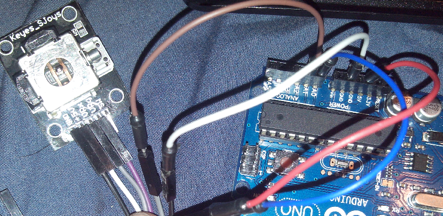
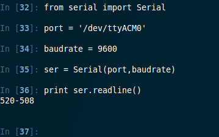

title: Python + Arduino = Controlando Mouse
category: misc
tags: arduino, serial, python, mouse

Una de las posibilidades de arduino es que nos entrega los valores de los dispositivos(analogos y digitales) por _Serial_
dichos valores pueden ser capturados, por algún dispositivo escuchando el puerto. Por ejemplo python! .

Los puerto que se aloja arduino se separan según el tipo de S.O. y también dependiendo de la placa arduino que se
utilice, por ejemplo en linux la arduino UNO se podría aloja en el puerto.

~~~{bash}
	'dev/ttyACM0'
~~~

Para tener más ayuda vean el el programa arduino que puerto es el que están utilizando.

Para enviar información por ese medio, debemos programar la arduino y habilitar la salida _Serial_ de datos, pero además
del medio que se propaga hay especificar el _baudrate_ que vendría siendo algo así como el puerto que se escuchara.

Sabiendo esto podemos hacer que una rutina en python escuche este puerto (aclaro que no sólo es para escuchar también se 
pueden enviar datos) y pueda con lo datos que reciba hacer lo que se quiera!.

Yo voy a controlar el mouse con python obteniendo los datos de la arduino :D. Suena extraño pero es posible y no es muy
complicado pero lo vamos a realizar paso a paso para que se entienda cómo funciona. No es algo muy compliclado
sólo debemos tener precaución, ya que sólo un medio puede escuchar el puerto (no pueden dos medios distintos; por ejemplo 
python y arduino al mismo tiempo).

<iframe  src="//www.youtube.com/embed/VY-pRjF-k3k" frameborder="0" allowfullscreen></iframe>

Lo que necesitamos es un dispositivo análogo que retorne dos valores. Un computador que tenga el intérprete de python.

Requisitos:

* Computador con python
* Un dispositivo que retorne dos valores análogo
* Arduino

En mi caso tengo un joystick que venía en un pack que compre con la arduino:

* GND a GND de arduino
* 5V+ a 5V de arduino
* VRx a A0 de arduino
* VRy a A1 de arduino

Vamos por parte, primero programar la placa para que envié los dos valores por _Serial_. Como yo lo pensé fue lo siguiente;
para facilitar el trabajo a python y aprovechar sus dotes con string, es enviar los dos valores separados por un '-'. 
Así después con split de python obtener los dos valores. Entonces primera meta imprimir un string por _Serial_.

_(Ojo si no se entiende que es Serial, buscar en internet para aclarar sus dudas o ver en mi
[blog](http://alumnos.informatica.utem.cl/~srocha/serial-arduino.html) donde explico un poco)_

~~~{Arduino}
String stringOne;
String stringTwo;

void setup()
{
	Serial.begin(9600); // baudrate
}
void loop()
{
	String stringOne =  String(analogRead(A0), DEC); //Obtenemos el valor en por serial del Analogo A0
	String stringTwo = String(analogRead(A1), DEC); //Obtenemos el valor en por serial del Analogo A1
	Serial.println(stringOne+"-"+stringTwo);
	delay(10);
}
~~~

Esta más que claro que el dispositivo debe estar conectado a los pines A0 y A1. Si todo va como corresponde habiliten el
monitor serial de arduino (Herramientas->Monitor Serial) y debieran resultar algo así:

Los datos se están enviando por _Serial_ veamos si podemos recibir estos datos por python. Existe una librería que realiza
la mayor parte del trabajo, esta se llama _Serial_. Si no la tiene instalada la pueden bajar sin problemas. Sólo necesita
dos parámetros importantes uno el puerto que se esta utilizando y el otro el _baudrate_. En mi caso el puerto es el
_'dev/ttyACM0'_ y _baudrate_ es el 9600. Para leer los valores que se envían por _Serial_ simplemente debemos usar la
función _readline()_ 

~~~{python}
from serial import Serial

port = '/dev/ttyACM0' #verificar bien que puerto esten utilizando si es windows es distinto (COM)
baudrate = 9600 #baudrate que se elije en arduino al programar

ser = Serial(port,baudrate)

print ser.readline()
~~~

^^ Esta vivo, ahora debemos controloar el mouse, yo utilicé la librería [PyMouse](https://github.com/pepijndevos/PyMouse),
 pero es obvio que pueden usar la que quieran. Les recomiendo PyMouse ya que es súper simple de usar y es para todos los
 S.O. .

Hagamos una prueba simple:

~~~{python}
from pymouse import PyMouse
m = PyMouse()
m.move(0,0)
~~~
Debe move el mouse a la esquina inferior izquierda. Ven que es simple de usar esta librería, algunas de sus otras
funciones:

- - -

>* move: necesitas dos parámetros, para mover el mouse a esa dirección
>* screen_size: función que nos devuelve el tamaño de la pantalla actual
>* position: retorna los valores (x,y) de la posición actual del mouse, no requiere párametros.

- - -

Dado que el puerto _Serial_ puede fallar por distintos motivos (Se desconecto, otro dispositivo quiere escuchar el puerto,
etc. ) es que usaremos un capturador de excepciones, si llega a ocurrir un problema (se captura la excepción) dejaremos
el mouse en su posición actual (con la función _position_). Sí todo va bien y no ocurre excepción le daremos los valores
que nos entraga el dispositivo, pero _Ojo_ los valores de los dispositivos análogos fluctúan entre 0 a 1023 y como
no sabemos la resolución de las pantallas, usaremos una simple regla de 3, para transformar esos 0 a 1023, a 0 y 
y el tamaño de la pantalla, aquí nos ayudara la función _screnn_size_ .

~~~{python}
#!/usr/bin/env python

from serial import Serial

port = '/dev/ttyACM0' #verificar bien que puerto esten utilizando si es windows es distinto (COM)
baudrate = 9600 #baudrate que se elije en arduino al programar

ser = Serial(port,baudrate)

from pymouse import PyMouse
m = PyMouse()

while True:
   try:
      value = ser.readline()
      x = int(value.split('-')[0]) # aca obtenemos los valores x e y que nos envia, arduino
      y = int(value.split('-')[1])

      x_max = m.screen_size()[0] # la resolucion maxima que deben fructuar nuestro valores
      y_max = m.screen_size()[1]

      print x,y

      x = x*x_max/1023 #transformamos los valores
      y = y*y_max/1023

   except: #Ups ocurrio un error

      x = m.position()[0] #pero no hay problema, dejaremos el mouse donde estaba!
      y = m.position()[1]
   
   m.move(x,y) #GO! mueve el mouse
~~~

Y sería todo, espero que les haya funciona y gustado este mini tutorial. Ah y una aclaración y que es importante
después de que se utiliza _Serial_ deben cerrar la conexión, con la función _close_ de _Serial_ en python.

Saludos :D.
