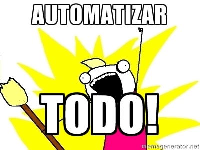
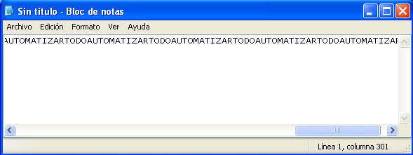
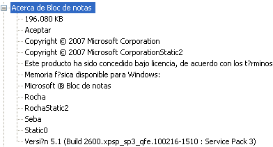

title: Automatizar Gui con python
category: misc
tags: python,pywinauto

Para una pega que tuve hace poco, me pidieron realizar reportes del un programa cada cierto período de tiempo, el programa (que era horrible y no diré su nombre) generaba archivos xls según el tipo de reporte que se quería. Era obvio que no se podía tener a una persona todos los días haciendo click en el programa para hacer un reporte es por eso que me pidieron automatizar esto.



Automatizar un programa suena algo extraño pero es posible, esto generalmente se usan como robot para que realicen ciertos paso que siempre serán los mismos. Algo así como un bot, la idea es no este una persona.

Buscando en internet de una manera fácil, en pocas lineas y que fuera en pytyon es que llegue a pywinauto una librería open source.

#Pywinauto

Es una librería de python que se usa para windows, controla aplicaciones de manera cómoda con simples instruciones.
##Instalación

La instalación es de manera sencilla puede hacerlo desde la misma página de [pywinauto](http://code.google.com/p/pywinauto/ "->Download") van a download y descargan el zip. Luego lo descomprimen y van a carpeta y dan por consola.
```bash
python setup.py install
```

Otra forma es utilizando pip si lo tienen instaldo en windows es simple
```cmd
pip install pywinauto
```
##Probando pywinauto
Para probar la librería, puede usar la shell de python, para abrirla van a _c:pythonXX/python.exe_, donde xx varia según la versión de python que hayan instalado o si está en el path, en la consola de windows usan python.

Lo primero es cargar la librería, eso se hace de forma simple
```python
from pywinauto import application
```
Ahora podemos usar una aplicación por medio de python, jugemos un rato con el **bloc de notas** (notepad.exe), en la misma shell arracamos el bloc de notas
~~~python
app = application.Application.start("notepad.exe")
~~~
Y voalá se abre el bloc de notas!. Ahora viene la gracia del programa que es controlar el programa y escribir en los cuadros de texto, por ejemplo para escribir en el bloc de nota, con el mismo objeto que creamos (_app_) le decimos que escribiremos el famoso **AutomatizarTodo** en notepad que acabamos de iniciar
~~~python
app.notepad.TypeKeys("AutomatizarTodo"*20)
~~~

También se puede usar las barra de menú de arriba (Archivo,Edición,etc), por ejemplo veamos el _Acerca de_ de el bloc de notas que esta en **ayuda->acerca del bloc de notas** por lo menos en mi versión de bloc de notas.
~~~{python}
app.notepad.MenuSelect("Ayuda->Acerca del bloc de notas")
~~~
Sí bien no hay problema para escribir y ver los menú para bloc de notas, no surge lo mismo para otras aplicaciones como (calculadora, word, mover carpetas, etc). Una heramienta que ayuda mucho a solucionar este problema es [SWAPY](http://code.google.com/p/swapy/ ""). Que es algo así como un complemento para pywinauto.

##Swapy
Swampy facilita la localización y nombre de las opciones de una aplicación, mostrando todo lo que pywinauto puede controlar y hacer click!. Es una maravilla.

Primero descarguen el _exe_ de su [página oficial](http://code.google.com/p/swapy/ "") en download. Cuando lo inicien veran en el panel de la izquierda todas las aplicaciones que estan corriendo actualmente, en el de la derecha son el código que nos entrega el programa y las propiedades de una aplicación especifica.



Para entender mejor vamos con un ejemplo, y seleccionamos el _Acerca de bloc de notas_ ahí deben hacer segundo click y presionen _SetFocus_ que es para centrarnos en está gui. Ahora vean las demás opciones que tiene, debe haber un _Aceptar_ hagan segundo click y _Click_ en las opciones que salgan. Si observaron el panel de la izquierda se iba llenando con código, esté tiene todas las indicaciones que le dimos, que es centrance en acerca de bloc de notas y luego hacer click en aceptar, si copian ese código debería realizar lo que les mencione, a mí mi genero esto:
~~~python
import pywinauto
 
pwa_app = pywinauto.application.Application()
w_handle = pywinauto.findwindows.find_windows(title=u'Acerca de Bloc de notas', class_name='#32770')[0]
window = pwa_app.window_(handle=w_handle)
window.SetFocus()
ctrl = window['Button']
ctrl.Click()
~~~

Y eso sería todo, espero que les haya gustado y lo puedan utilizar algún día, nunca es malo saber algo más :D.

Saludos ;)