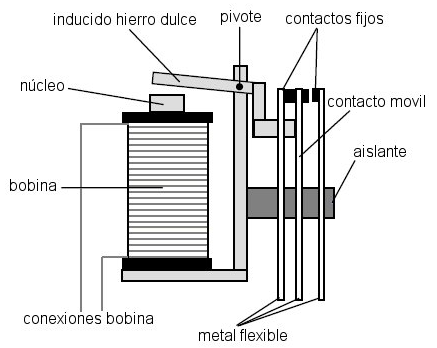
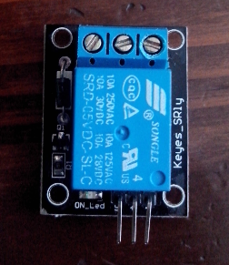
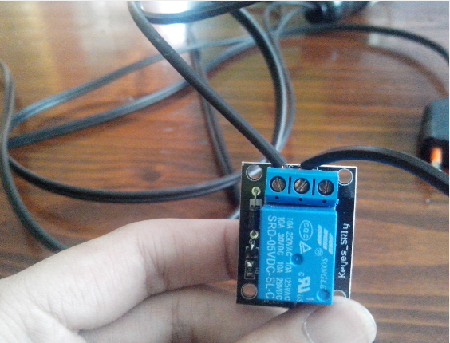
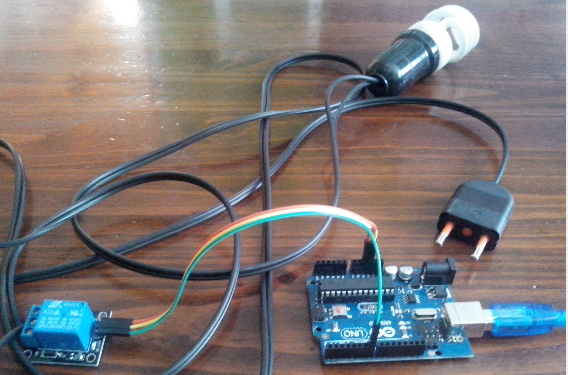
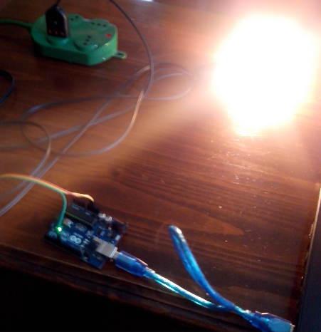

title: Conectar un relé a la arduino
category: misc
tags: rele,arduino

Hola de nuevo, desde hace mucho tiempo que no escribía algo, por pura flojera nomás.
Pero ahora que tengo mucho tiempo gracias a las vacaciones subiré unos post bastante interesantes. Por ahora verán
como se conecta un relé a la arduino, para manipular dispositivos electrónicos. Por ejemplo yo logré conectar una 
lámpara. Encender y apagar la lámpara.

#¿Qué es un relé?

La verdad no tengo mucho conocimiento del cómo funciona por dentro o de qué esta compuesto. Pero funciona como una 
especie de interruptor, que se puede alterar para que permita dejar o quitar corriente al dispositivo que se le 
conecte.

##Conectar con la arduino

Yo en mis manos tengo el siguiente relé que venia con un pack que compre desde China por medio de dealextreme. 

Tiene 3 pines que se conecta a la aduino, que están en la parte de abajo. La parte de arriba es la que conecta
al dispositivo externo que se desea controlar, pero esto lo explicare más adelante. Centrémonos en los pines 
que van a la arduino. Si se fijan sale de la siguiente manera "S + -", de izquierda a derecha. El primero se conecta
a un pin digital, + va a 5v y - a GND que es tierra.

Se conecta al un pin digital por que se controla, por medio de un 1 -High- es dejar pasar corriente o 0 -Low-
que corte la interrupción.

##Conectar la lámpara

Para conectar la lámpara tendrán que cortar un cable y conectar a las dos primeras conexiones del relé, bueno
una imagen explica más que mil palabras, deben hacer esto:

Si usan unan lámpara y tiene un botón, sería más conveniente que lo desarmaran el botón ya que ahí mismo esta el cable
cortado y ya listo para conectar al relé.

##Rutina en la arduino

Vamos por el código ahora para la arduino. Pero antes una pequeña foto de como debería estar todo:

Enchufen la lámpara a corriente (sin miedo no pasara nada malo). Conecten el pin digital del relé a la arduino (Pin 7
lo conecte, pero puede ser cualquiera digital). Y cargamos el siguiente código:

~~~{Arduino}

int pinRele = 7;

void setup()
{
  pinMode(pinRele,OUTPUT);
}

void loop()
{
  digitalWrite(pinRele,HIGH);
  delay(5000);
  digitalWrite(pinRele,LOW);
  delay(5000);
}

~~~

Y _listoco_, la lámpara debería cambiar de estado cada 5 segundos. Hasta acá este post, bastante básico pero que puede
ayudar mucho si queremos realizar domótica en nuestra casa.

Saludos!