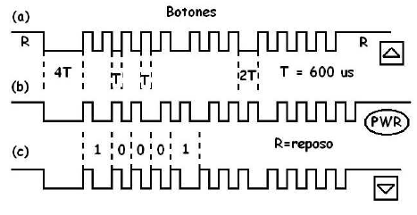
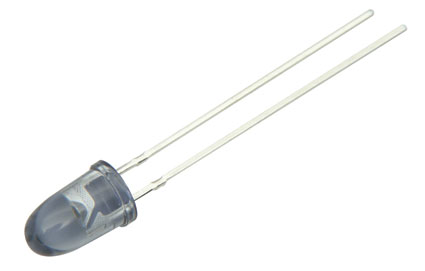
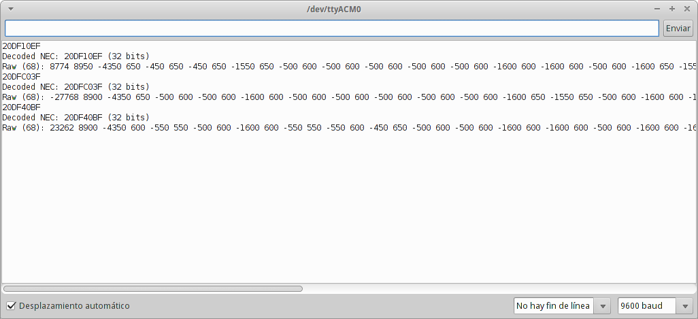
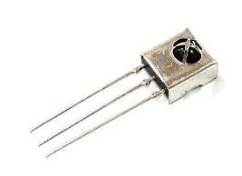
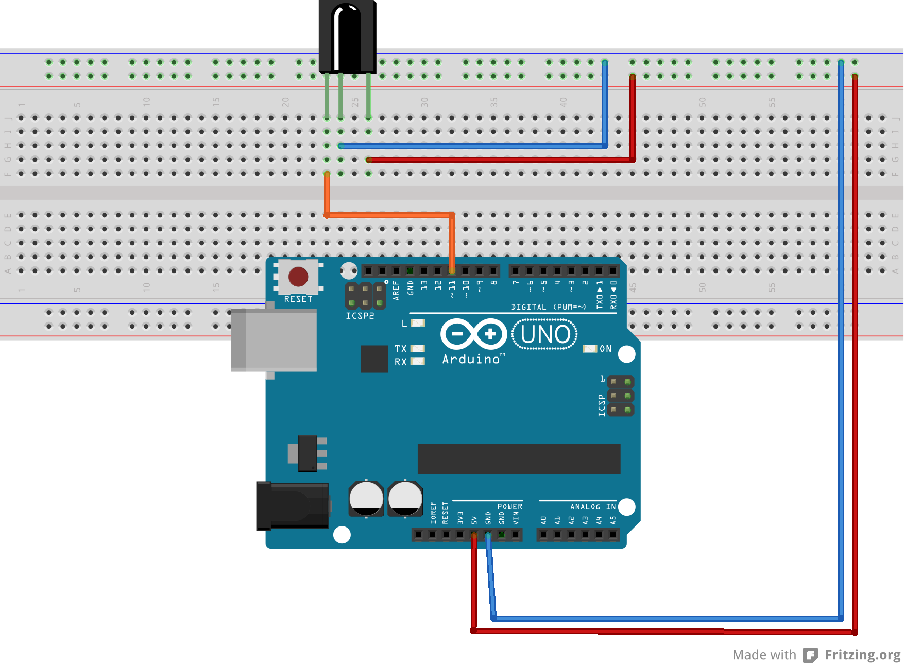

title: Control universal con arduino. Utilizando un emisor y receptor infrarrojos
category: misc
tags: infrarrojas, led, arduino

Les traigo un tutorial para crear un control universal con la arduino. Esto usando emisores infrarrojos que serán enviado desde la arduino al dispositivo que queremos apuntar. Acá un vídeo para que les quede un poco más claro, yo lo hice aplicándolo en el televisor de mi casa.

<iframe  src="//www.youtube.com/embed/SV6HtHokyd8" frameborder="0" allowfullscreen></iframe>

###Cómo funciona un control remoto

Los controles remotos en la actualidad emiten señales infrarrojas por medio de un led que tiene en un extremo. Estás señales viajan por el medio y llegan al dispositivo que lo recibe por medio de un receptor de señales infrarrojas que decodifica la señal y toma una decisión según la señal que llega.

###Señales infrarrojas

Las señales infrarrojas son distintas para cada botón que se presione, estas van cambiando. Hay controles que están configurado para emitir 3 o más veces esta señal, por si alguna se pierde. Las señales que se envían son digitales, que se van siendo separadas por un cierto delay pequeño, alterando estos parámetros se pueden generar distintas señales. Por ejemplo acá algunas señales de un control x que encontré en internet.



Para emitir una señal se utiliza como ya dije antes un led infrarrojo, que son rebaratos y se encuentra en cualquier control remoto que tengas en nuestra casa, yo desarme uno que no utilizaba, pero les recomiendo comprarlo.



Para hacer la tarea más simple, las señales se pueden separar como un simple código hexadecimal que se puede enviar desde la arduino, pero eso lo veremos más adelante.

###Receptor infrarrojas.

Son simples dispositivos que decodifican una señal infrarroja que les llega. No son muy caras pero si dificiles de encontrar. Estás pueden recibir cualquier señal infrarroja.



En la imagen anterior tenemos un ejemplo del uso de un receptor que decodifica en este caso tres señales infrarrojas -emitidas por mi control remoto- .

Acá la imagen de un receptor infrarrojas:



###Librería IR-Arduino

Para nuestra facilidad existe una librería de arduino que ayuda bastante, tanto para emitir señales como para decodificarlas. [Arduino-IRremote](https://github.com/shirriff/Arduino-IRremote "") es la librería. Su instalación es fácil , debemos saber si donde esta instalado el de IDE de arduino. Descargen la librería haciendo click en "Download ZIP" y lo tiene que descomprimir en:
```bash
arduino-1.x/libraries/IRremote
```
_donde x es la versión del IDE que están utilizando_

**Ojo la carpeta debe ser llama IRremote no Arduino-IRremote-master**

###Decodificando una señal con arduino

Ya teniendo instalada la librería, podemos seguir el tutorial. Primero deben generar estas conexiones. El receptor lo conectamos al pin 11, los demás pines son de alimentación (5V) y GND.



####Código arduino:

Y en la arduino cargamos el código de ejemplo para recibir una señal:

```cpp
/*
 * IRremote: IRrecvDump - dump details of IR codes with IRrecv
 * An IR detector/demodulator must be connected to the input RECV_PIN.
 * Version 0.1 July, 2009
 * Copyright 2009 Ken Shirriff
 * http://arcfn.com
 * JVC and Panasonic protocol added by Kristian Lauszus (Thanks to zenwheel and other people at the original blog post)
 */

#include <IRremote.h>

int RECV_PIN = 11;

IRrecv irrecv(RECV_PIN);

decode_results results;

void setup()
{
  Serial.begin(9600);
  irrecv.enableIRIn(); // Start the receiver
}

// Dumps out the decode_results structure.
// Call this after IRrecv::decode()
// void * to work around compiler issue
//void dump(void *v) {
//  decode_results *results = (decode_results *)v
void dump(decode_results *results) {
  int count = results->rawlen;
  if (results->decode_type == UNKNOWN) {
    Serial.print("Unknown encoding: ");
  } 
  else if (results->decode_type == NEC) {
    Serial.print("Decoded NEC: ");
  } 
  else if (results->decode_type == SONY) {
    Serial.print("Decoded SONY: ");
  } 
  else if (results->decode_type == RC5) {
    Serial.print("Decoded RC5: ");
  } 
  else if (results->decode_type == RC6) {
    Serial.print("Decoded RC6: ");
  }
  else if (results->decode_type == PANASONIC) {	
    Serial.print("Decoded PANASONIC - Address: ");
    Serial.print(results->panasonicAddress,HEX);
    Serial.print(" Value: ");
  }
  else if (results->decode_type == JVC) {
     Serial.print("Decoded JVC: ");
  }
  Serial.print(results->value, HEX);
  Serial.print(" (");
  Serial.print(results->bits, DEC);
  Serial.println(" bits)");
  Serial.print("Raw (");
  Serial.print(count, DEC);
  Serial.print("): ");

  for (int i = 0; i < count; i++) {
    if ((i % 2) == 1) {
      Serial.print(results->rawbuf[i]*USECPERTICK, DEC);
    } 
    else {
      Serial.print(-(int)results->rawbuf[i]*USECPERTICK, DEC);
    }
    Serial.print(" ");
  }
  Serial.println("");
}


void loop() {
  if (irrecv.decode(&results)) {
    Serial.println(results.value, HEX);
    dump(&results);
    irrecv.resume(); // Receive the next value
  }
}
```

Ahora habiliten el monitor serial (ctrl+Mayus+m), luego acerquen su control y presionan un botón y veran que el receptor decodifica esta señal :D. En mi caso fue el siguiente resultado, el orden fue primero Power, luego Vol +, y al final Vol-.


Lo que nos interesa del resultado, es el _Decode Nec_ y cuántos bits utiliza. Por ejemplo
```bash
Decode NEC: 20D10ED (32 bits)
```
**Deben tener ojo cuando reciben el Decode NEC, este debe tener un largo de 7 caracteres(números y letras), hay algunas señales que al decodificar tienen un largo de 5 caracteres**

Entonces para falsear una señal debemos emitir esta con las mismas características que detectó el decodificador. En la librería IRremote existe una herramienta que emite señales que se llama _IRsend_

###Emitir una señal infrarrojas desde arduino desde un led

Con los datos obtenidos anteriormente podemos ya emitir, pero recuerden que necesitamos el led infrarrojas. Como es un led tiene un ánodo y cátodo, que hace la diferencia entre negativo y positivo respectivamente. Esta diferencia se observa en las _patitas_ que tiene los led, donde una es más larga que la otra, la que es más larga debe ir al positivo (en este caso a un pin digital de la arduino) y la más corta a negativo, o sea a GND del arduino. Pero antes de hacer la conexión debemos tener precaución no se puede conectar a 5v directo - que es lo que entrega arduino - , por lo que hay que conectar una resistencia de **1K ohm**.


La librería como ya mencione puede emitir señales infrarrojas, pero el led tiene que estar conectado sí o sí la **pin 3**, digital en Arduino UNO.

Entonces para emitir una señal utilizando la librería debemos primero **inicializar** la herramienta _IRsend_. Por lo sólo debemos asignarle un nombre al _objeto IRsend_. Así:
```cpp
IRsend irsend;
```
Ahora el objeto irrsend tiene un motón de método para utilizar, el que nos interesa a nosotros el _irsend.sendNEC()_ que deben ir dos parámetros, el primero es un valor hexadecimal(que obtuvimos con el receptor anteriormente) y el segundo es la cantidad de bits que utiliza(que también lo descubrimos con el receptor). Por ejemplo para falsear el botón _power_ de mi control remoto, tendríamos que hacer lo siguiente:

Power:
```bash
Decode NEC: 20DF10EF (32 bits)
```
```cpp
irsend.sendNEC(0x20DF10EF,32);
```

Como se dan cuenta debe anteponer un 0x luego el valor (que deben ser 7 caracteres si no lo son entonces tiene que poner '0' antes) y luego la cantidad de bits que el receptor les entregó.

Ok, vamos ready entonces intentemos encender el televisor. Para esto yo conecte un botón simple que lo asigne al pin 2, que al presionar emitirá la señal ya antes mencionada.


####Código:
```cpp
#include <IRremote.h>

IRsend irsend;
int pinButton = 2;
int valor_button;

void setup()
{
  Serial.begin(9600); //solo para verificar que se esta enviando la señal
  pinMode(pinButton,INPUT); //voy a usar el pin 2 como entrada
}

void loop()
{
  valor_button = digitalRead(pinButton); //que valor tiene el pin 2
  if(valor_button == HIGH) //si esta en arriba entonces
  {
    irsend.sendNEC(0x20DF10EF,32); //envia una señal
    Serial.println("Enviado"); // imprime por serial que fue enviado
    delay(100); //espera 100 milisegundos
  }
}

```
Y listo prueben acercando a su televisor y presionando el botón, el televisor en mi caso encendió :D. 
